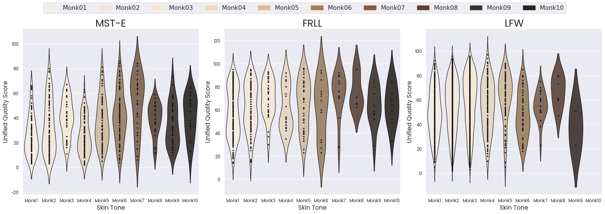

# Demographic Variability in Face Image Quality Measures

This repository contains:

1. Plots for the score distributions of a selected set of FIQA measures over 4 demographic variables:

   - age
   - gender
   - race
   - skintone

2. Skin tone labels using the [Monk Skintone Scale (MST)](https://skintone.google/) as judged by human experts.

    - [FRLL](https://figshare.com/articles/dataset/Face_Research_Lab_London_Set/5047666) (102 subjects are labelled)
    - [LFW](https://vis-www.cs.umass.edu/lfw/) (800 subjects are labelled)

## Skin tone

## Age

## Gender

## Race

